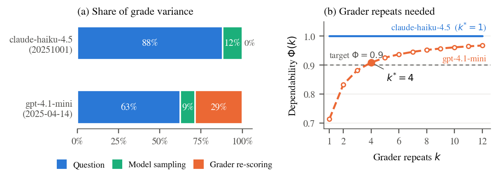

# grader-variance

An [Inspect](https://inspect.aisi.org.uk/) extension that measures **how much of a
benchmark's score is the grader**. It isolates LLM-grader (judge) variance from
model-sampling variance, decomposes the spread in a benchmark's headline number
into question / model / grader components, and gives a stopping rule for how many
grader repeats are actually needed.

## What is and isn't new here

That LLM judges are self-inconsistent across repeated runs is **established prior
art**, not a finding of this project:

- **Rating Roulette: Self-Inconsistency in LLM-As-A-Judge Frameworks** (EMNLP 2025
  Findings, [arXiv:2510.27106](https://arxiv.org/abs/2510.27106)) — ran each judge
  three times on identical prompts; Krippendorff's α from 0.33–0.79 on binary
  classification.
- **Reliability without Validity: A Systematic, Large-Scale Evaluation of
  LLM-as-a-Judge Models** ([arXiv:2606.19544](https://arxiv.org/abs/2606.19544)) —
  21 models, ~541,000 judgments; test-retest reliability, self-consistency, flip
  rate.

(Provenance note: a 0.38 decision flip rate that circulated in earlier project
notes came from a **seeded synthetic worked example** in the rater-agreement
library — no model calls — and is **not** a measurement. It serves only as a
reference-value fixture for unit tests. The measurements in this repository come
exclusively from the demonstration study recorded in the run manifest.)

What those papers explicitly decline to do — and what this project adds — is:

1. **Decompose** the spread in a reported benchmark score into (a) which questions
   were sampled, (b) model sampling on a fixed question, and (c) grader re-scoring
   of a fixed completion. Miller's **Adding Error Bars to Evals**
   ([arXiv:2411.00640](https://arxiv.org/abs/2411.00640)) handles (a) and (b) and
   explicitly assumes scores are already computed — i.e. excludes (c). This adds
   (c).
2. **A stopping rule** for the number of grader repeats, stated in Miller's form.
3. **Native Inspect integration** of the intra-grader case.

### What Inspect already provides, and what this adds

Inspect ships `krippendorff_alpha()` — but for agreement **across multiple
judges**, and its `epochs` re-run the **model**, producing new completions. This
extension covers the orthogonal case: **repeats of one judge on a frozen
completion**. It adds a fixed-completion harness, intra-grader metrics (flip rate,
ICC(1,1), test-retest, PABAK with prevalence/bias indices, grader variance share),
the variance decomposition, and the k-selection stopping rule. It does not
duplicate `krippendorff_alpha()`.

## Install

```bash
pip install git+https://github.com/joanna-ciesielski/grader-variance.git
```

The statistics are computed by the
[`rater-agreement`](https://github.com/joanna-ciesielski/rater-agreement) library
(DOI [10.5281/zenodo.21983269](https://doi.org/10.5281/zenodo.21983269)), which is
tested against published reference values (Feinstein & Cicchetti 1990; Byrt,
Bishop & Carlin 1993; Krippendorff 2011). This package's tests re-assert the
Inspect port against those same values, so the port is provably faithful.

## The fixed-completion harness

Inspect's `epochs` re-runs the model, so repeated epochs mix model variance with
grader variance. The harness does the opposite: **generate each completion once,
freeze it, then re-run only the scorer N times** — and verifies the completions
are byte-identical across repeats before any downstream number is trusted.

```python
from inspect_ai.scorer import model_graded_fact
from grader_variance import (
    freeze_completions, regrade_frozen, verify_frozen,
    flip_rate, test_retest, grader_variance_share,
)

# 1. Generate completions once and freeze them (uses an EXISTING Inspect eval).
frozen = freeze_completions(my_task, model="anthropic/claude-3-5-sonnet-latest")

# 2. Re-grade the frozen completions k times with a judge (grader variance only).
scored = regrade_frozen(
    frozen,
    model_graded_fact(),
    grader="openai/gpt-4o-mini",
    k=12,
    metrics=[flip_rate(), test_retest(), grader_variance_share()],
)

# 3. Prove the completions never changed across the 12 regrades.
assert verify_frozen(scored).ok
```

`verify_frozen` hashes each item's completion (assistant output + transcript)
across all its repeats and fails loudly if any changed — so a grader variance of,
say, zero can never be an artifact of the model quietly being re-invoked.

## Metrics

All are `@metric(scores="unreduced")` adapters over `rater-agreement`; attach them
via `regrade_frozen(..., metrics=[...])` (or Inspect's `score(metrics=...)`):

| metric | what it measures |
| --- | --- |
| `flip_rate()` | proportion of items whose grader decision changes across repeats |
| `icc_1_1()` | ICC(1,1): item identity vs. run-to-run grader noise |
| `test_retest()` | mean self-agreement of the grader across repeats |
| `pabak()`, `prevalence_index()` | kappa-paradox diagnostics for the grader's pass/fail decisions, over all unordered repeat-pairs (order-independent) |
| `grader_variance_share()` | headline: grader's share of the between-item + grader variance (random-effects component) |

The *bias index* (whether one rater passes systematically more than another) is a
two-rater diagnostic, so it is deliberately **not** an intra-grader metric —
repeated draws of one judge on a frozen completion are exchangeable and have no
"first vs second" direction for a bias to point in. For bias between two distinct
judges on the same completions, use `compare_judges(grades_a, grades_b)`
(`grader_variance.compare_judges`), which returns the full paradox work-up
(prevalence index, bias index, PABAK, Cohen's κ).

## Variance decomposition and the stopping rule

```python
from grader_variance import grades_array, decompose, k_selection_curve, stopping_rule_text

arr = grades_array(scored)            # (n_items, n_model_samples, n_grader_repeats)
comp = decompose(arr)                 # question / model / grader components
print(comp.as_dict())                 # ... plus grader_share, model_share, question_share

curve = k_selection_curve(arr, tol=0.05)
print("recommended grader repeats k =", curve.recommended_k)
print(stopping_rule_text(curve))
```

The components are estimated as **nested random-effects variance components**
(method-of-moments ANOVA), not observed variances of group means — the latter
would leak grader noise into the question and model terms and overstate them. The
components are additive: `question + model + grader` estimates the variance of a
single grade.

The stopping rule is Miller's, applied to the grader term: increasing k stops
helping once the grader variance term is negligible relative to the between-item
variance the item sample fixes,

```
sigma2_grader / (m * k)  <=  tol * sigma2_between
```

(`m` = model completions per item, 1 in the frozen single-completion case), and
`recommended_k` is the smallest k satisfying it. Miller's own stopping rule covers
model resamples and assumes `sigma2_grader = 0`; this supplies the missing term.
`recommended_k` is `1` when the grader term is already negligible (the null result
below), and `None` when the benchmark shows no between-item signal at all — in
which case no number of grader repeats can make the grader negligible relative to
a signal that is statistically absent, which is itself the finding. The curve is
hard-capped at `MAX_CURVE_K` points so a near-zero signal can never trigger an
unbounded computation.

## Null results are published as-is

If the grader variance term turns out to be small — the plausible outcome for a
low-temperature judge on an unambiguous task — the k-selection curve returns
`recommended_k = 1`, and that is reported directly. "For this benchmark and this
scorer the grader does not need repeating" is a real, useful finding, not a
failure, and is not buried. The one caveat is provider-side response caching,
which can zero out measured grader variance for reasons unrelated to reliability —
see [`docs/VALIDITY.md`](docs/VALIDITY.md).

## Validity

[`docs/VALIDITY.md`](docs/VALIDITY.md) states, **before any results**, what this
cannot tell you: one benchmark, one task type, two judge families, temperature and
seed effects unseparated, caching semantics, and whether a rule fitted on one
benchmark transfers. Read it first.

## Demonstration study

`examples/demo_study.py` runs the whole pipeline on one existing Inspect eval
(`theory_of_mind`) with two judge families:

```bash
python examples/demo_study.py \
  --model anthropic/claude-3-5-sonnet-latest \
  --graders anthropic/claude-3-5-haiku-latest openai/gpt-4o-mini \
  --k 12 --limit 50 --grader-temperature 1.0
```

A `--mock` flag runs the same pipeline with deterministic mock models (no API
keys) as a mechanism check — useful for confirming the plumbing computes, but its
numbers are **not** a scientific result and are labelled as such.

## Development

```bash
pip install -e ".[dev]"
ruff check . && ruff format --check .
mypy            # strict, on src
pytest -q       # tests for every statistic, incl. published reference values
```

CI runs all four on Python 3.10–3.12.

## Citing

See [`CITATION.cff`](CITATION.cff). Please also cite the prior art (Rating
Roulette; Reliability without Validity; Miller) and the `rater-agreement` library
(DOI 10.5281/zenodo.21983269).

## License

MIT — see [`LICENSE`](LICENSE).

## Figures

Variance components and the grader-repeat dependability curve from the
definitive study recorded in [`docs/RESULTS.md`](docs/RESULTS.md) (50 questions
x 3 model samples x 12 grader repeats, two judges). Figures from the earlier
k = 6 demonstration have been removed: that run is superseded in its entirety
and no number from it is reported anywhere.


